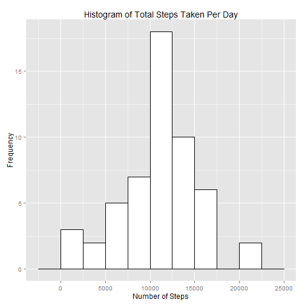
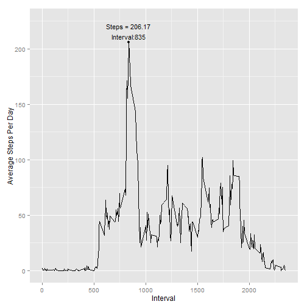
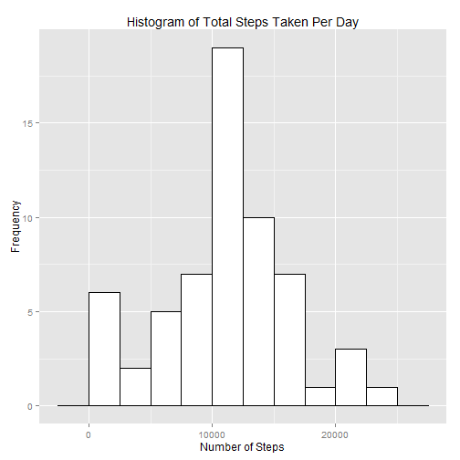
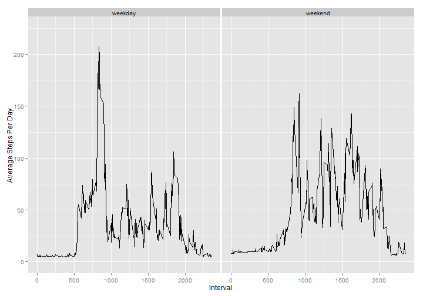

Loading Libraries and setting the working Directory
===================================================


```r
library(ggplot2)
library(plyr)

setwd("C:/Users/daniel/Desktop/Coursera -Data Science Track/Reproducible Research/Project")
```

Loading and preprocessing the data
===================================================

1. Load the data (i.e. read.csv())


```r
activity <- read.csv("activity.csv")
```

2. Process/transform the data (if necessary) into a format suitable for your analysis


```r
activity$date <- as.Date(activity$date)
```

What is mean total number of steps taken per day?
===================================================

1. Make a histogram of the total number of steps taken each day


```r
total_steps <- ddply(na.omit(activity)
  ,.(date)
	,summarize
	,total_steps = sum(steps))


ggplot(total_steps
		,aes(x=total_steps)) +
geom_bar(stat="bin",binwidth=2500, fill="white",color="black") +
ggtitle("Histogram of Total Steps Taken Per Day") + 
  ylab("Frequency") + xlab("Number of Steps")
```

 

2. Calculate and report the mean and median total number of steps taken per day


```r
mean(total_steps$total_steps)
```

```
## [1] 10766.19
```

```r
median(total_steps$total_steps)
```

```
## [1] 10765
```

What is the average daily activity pattern?
===========================================

1. Make a time series plot (i.e. type = "l") of the 5-minute interval (x-axis) and the average number of steps taken, averaged across all days (y-axis)


```r
average_steps <- ddply(activity
  ,.(interval)
	,summarize
	,average_steps = mean(steps,na.rm=TRUE)
)


maximum_number_of_steps <- average_steps[which.max(average_steps$average_steps),]

ggplot(average_steps
		,aes(x=interval,y=average_steps)) +
	geom_line() + geom_text(data=maximum_number_of_steps
			,aes(x=interval,y=average_steps
			,label=paste0("Steps = ",round(average_steps,2),"\nInterval:",interval))
			, vjust=-0.2, size=4) +
	geom_point(data=maximum_number_of_steps
			,aes(x=interval,y=average_steps)) +
	ylim(c(0,225)) + ylab("Average Steps Per Day") +
	xlab("Interval")
```

 

2. Which 5-minute interval, on average across all the days in the dataset, contains the maximum number of steps?


```r
#Calculated in prior step
maximum_number_of_steps
```

```
##     interval average_steps
## 104      835      206.1698
```

Imputing missing values
=======================

Note that there are a number of days/intervals where there are missing values (coded as NA). The presence of missing days may introduce bias into some calculations or summaries of the data.

1. Calculate and report the total number of missing values in the dataset (i.e. the total number of rows with NAs)


```r
sum(!complete.cases(activity))
```

```
## [1] 2304
```

2. Devise a strategy for filling in all of the missing values in the dataset. The strategy does not need to be sophisticated. For example, you could use the mean/median for that day, or the mean for that 5-minute interval, etc.


I will fill in the missing values with the average number of steps for that interval.


3. Create a new dataset that is equal to the original dataset but with the missing data filled in.


```r
activity_cleaned <- activity


activity_cleaned$average_steps_for_interval <-
          merge(x=activity_cleaned,y=average_steps,by = "interval")$average_steps

activity_cleaned$steps <- ifelse(is.na(activity_cleaned$steps)
    ,activity_cleaned$average_steps_for_interval
    ,activity_cleaned$steps
)
```

4. Make a histogram of the total number of steps taken each day and Calculate and report the mean and median total number of steps taken per day. Do these values differ from the estimates from the first part of the assignment? What is the impact of imputing missing data on the estimates of the total daily number of steps?


```r
cleaned_total_steps <- ddply(activity_cleaned
                     ,.(date)
                     ,summarize
                     ,total_steps = sum(steps))

ggplot(cleaned_total_steps
       ,aes(x=total_steps)) +
  geom_bar(stat="bin",binwidth=2500, fill="white",color="black") +
  ggtitle("Histogram of Total Steps Taken Per Day") + 
  ylab("Frequency") + xlab("Number of Steps")
```

 

Yes the Mean and the Median have increased after imputing the missing values.


```r
mean(cleaned_total_steps$total_steps)
```

```
## [1] 10889.8
```

```r
median(cleaned_total_steps$total_steps)  
```

```
## [1] 11015
```

Are there differences in activity patterns between weekdays and weekends?
============================================================================

For this part the weekdays() function may be of some help here. Use the dataset with the filled-in missing values for this part.

1. Create a new factor variable in the dataset with two levels - "weekday" and "weekend" indicating whether a given date is a weekday or weekend day.


```r
activity_cleaned$day_type <- ifelse(weekdays(activity$date) %in% c("Sunday","Saturday")
   ,"weekend"
   ,"weekday"
)

activity_cleaned$day_type <- as.factor(activity_cleaned$day_type)
```


2. Make a panel plot containing a time series plot (i.e. type = "l") of the 5-minute interval (x-axis) and the average number of steps taken, averaged across all weekday days or weekend days (y-axis). See the README file in the GitHub repository to see an example of what this plot should look like using simulated data.


There Appears to be on average more steps earlier in the day during the Weekdays than on the Weekends. Additionally there appears to be more steps later in the day during the Weekends than during the Weekdays.


```r
average_steps_by_day_type <- ddply(activity_cleaned
      ,.(day_type,interval)
      ,summarize
      ,average_steps = mean(steps)
      )

ggplot(average_steps_by_day_type
       ,aes(x=interval,y=average_steps)) +facet_wrap(~day_type, nrow=1) +
  geom_line() +
  ylim(c(0,225)) + ylab("Average Steps Per Day") +
  xlab("Interval")
```

 

